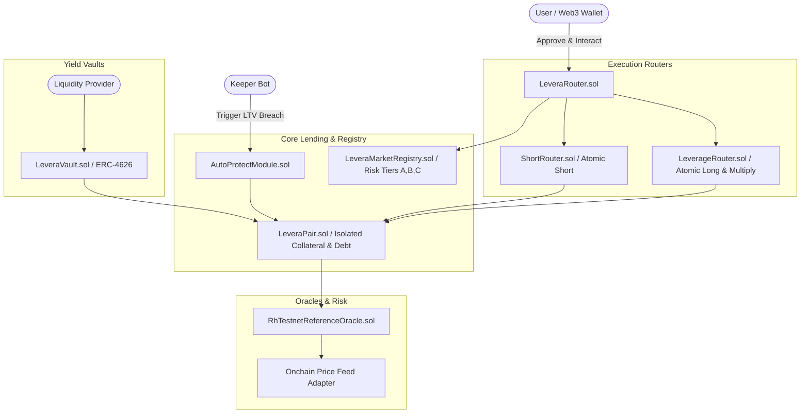

# LEVERA MARKETS

> **Leverage for tokenized assets on Robinhood Chain.**

Levera Markets is the credit and leverage layer built for tokenized assets (equities, ETFs, and RWAs) on [Robinhood Chain](https://explorer.testnet.chain.robinhood.com). It provides a modern brokerage margin experience — **Borrow, Earn, Long, Short, Multiply, Auto-Protect** — over isolated lending markets, with each tokenized asset operating in its own risk-isolated pair.

---

## Architecture Overview

```
User / Web3 Wallet
       │
       ▼
  LeveraRouter ─────────────┐
       │                     │
       ├── LeverageRouter    │  (Atomic Long & Multiply)
       ├── ShortRouter       │  (Atomic Short)
       └── AutoProtectModule │  (Keeper Deleverage)
              │
              ▼
       LeveraPair (Isolated Lending)
              │
              ▼
   RhTestnetReferenceOracle
              │
       LeveraMarketRegistry (Risk Tiers A/B/C/Experimental)
              │
       LeveraVault (ERC-4626 Yield)
```

---

## Current Status — RH Testnet (Chain 46630)

**Core deployment: COMPLETE.** 8 contracts deployed and verified on Robinhood Chain Testnet. Direct-pair lending lifecycle (deposit → borrow → repay → withdraw) has **PASSED** with real TSLA/USDG. Public-testnet trading remains **DISABLED** pending continuous oracle publishing and browser-wallet acceptance.

### Deployed Contracts

| Contract | Address | State |
| :--- | :--- | :--- |
| `LeveraMarketRegistry` | [`0x4c9b…c028`](https://explorer.testnet.chain.robinhood.com/address/0x4c9bebb141b0fa7708d54ee7f191543b7094c028) | 1 registered market; owner verified |
| `LeveraRouter` | [`0x09e7…f7f1`](https://explorer.testnet.chain.robinhood.com/address/0x09e7915e04301af563e892589d79ad11294cf7f1) | Authorized in registry |
| `LeverageRouter` | [`0x8418…8079`](https://explorer.testnet.chain.robinhood.com/address/0x84185563fc617733331fcaee61ee20d8f2f08079) | Paused; swaps/close incomplete |
| `ShortRouter` | [`0x8dd0…6601`](https://explorer.testnet.chain.robinhood.com/address/0x8dd0c5eb6d58ea121e9663eb740acb4a2b956601) | Paused; reverse market incomplete |
| `AutoProtectModule` | [`0xca7f…d97`](https://explorer.testnet.chain.robinhood.com/address/0xca7ff6017401cf2f0f77aa740f577c54c6358d97) | Paused; deleveraging incomplete |
| `LeveraVault` | [`0x122c…f628`](https://explorer.testnet.chain.robinhood.com/address/0x122c4da3276d4981edb941a3d3dd4da8985df628) | Deposit/mint closed |
| `RhTestnetReferenceOracle` | [`0x1dc0…d488`](https://explorer.testnet.chain.robinhood.com/address/0x1dc060daa19a8b3f090b3eb4bd866ace4dd5e488) | 3 real price publications |
| `LeveraPair` (TSLA/USDG) | [`0xaf36…08d5`](https://explorer.testnet.chain.robinhood.com/address/0xaf36b862f9d0b3eb19c0318e92d8f07e571608d5) | Lifecycle passed; paused |

### Remaining Work

- **OPS-01:** Continuous price publisher with health checks and source validation
- **OPS-02:** Browser-wallet acceptance for `/lending`
- **OPS-03:** Canonical event indexing with idempotency and reorg recovery
- **PRODUCT-01:** Long/Short swap execution and closing flows
- **PRODUCT-02:** Vault allocation/interest and AutoProtect collateral-funded execution
- **RELEASE-01:** Public exposure controls, rate limits, recovery runbooks

See [RH Testnet Status](docs/RH_TESTNET_STATUS.md) and [RH Core Deployment](docs/RH_CORE_DEPLOYMENT_COMPLETE.md) for full evidence.

---

## Product Features

- **Isolated Lending Markets:** Every tokenized asset (TSLA, AAPL, NVDA, SPY) operates in its own isolated pair to contain volatility and oracle risks.
- **1-Click Leverage (Long & Short):** Open 1.25x–2.5x leveraged positions without manual multi-step swaps or flash loans.
- **Auto-Protect Guard:** Offchain keeper service monitors account health and automatically deleverages at user-defined LTV thresholds before liquidation.
- **ERC-4626 Yield Vaults:** Deposit stablecoins into yield-bearing vaults that allocate across isolated lending markets.
- **RPC Privacy Shield:** All browser RPC traffic proxied through `/api/rpc`; provider credentials never exposed to DevTools.
- **Pure Backend API Gateway:** Frontend never directly connects to Supabase; all data flows through `apps/api`.
- **Zero-Fallback Policy:** Zod-validated environment variables with fail-fast on any missing configuration.

---

## Monorepo Structure

```text
levera/                                 # Monorepo root (Turborepo + pnpm)
├── data/                               # Static JSON configuration
│   ├── asset-catalog.json              # Asset names, icons & metadata
│   ├── tokens.json                     # Token metadata (per network)
│   ├── markets.json                    # Isolated pair parameters & risk tiers
│   └── vaults.json                     # ERC-4626 vault allocations
├── apps/
│   ├── web/                            # Next.js 14+ (App Router) — Dark theme UI
│   ├── api/                            # Express REST API (Supabase gateway)
│   ├── indexer/                        # EVM event indexer (Supabase sync)
│   ├── keeper/                         # Auto-Protect offchain worker bot
│   └── price-oracle/                   # Real-time price feed service
├── packages/
│   ├── contracts/                      # Foundry smart contracts (Solidity 0.8.24)
│   │   ├── src/                        # Contract source code
│   │   │   ├── core/                   # LeveraPair (Isolated Lending Engine)
│   │   │   ├── registry/               # LeveraMarketRegistry (Risk Tiers)
│   │   │   ├── routers/                # LeveraRouter, LeverageRouter, ShortRouter
│   │   │   ├── modules/                # AutoProtectModule (Keeper Deleverage)
│   │   │   ├── vaults/                 # LeveraVault (ERC-4626)
│   │   │   ├── oracle/                 # RhTestnetReferenceOracle
│   │   │   └── interfaces/             # Contract interfaces
│   │   ├── test/                       # Foundry unit & fuzz tests
│   │   ├── script/                     # Deployment scripts (Forge Script)
│   │   └── deployments/                # Deployment receipts & artifacts
│   └── types/                          # Shared TypeScript interfaces (@levera/types)
├── scripts/                            # Deployment & verification scripts
├── tests/                              # Integration & boundary tests
├── supabase/                           # PostgreSQL migrations & seed data
│   ├── migrations/
│   └── seed.sql
├── docs/                               # Deployment checkpoints & evidence
├── .env.example                        # ENV template (Zod-validated)
├── .env.testnet.example                # Testnet ENV template
├── .env.mainnet.example                # Mainnet ENV template
├── Dockerfile                          # pnpm monorepo container build
├── nixpacks.toml                       # Railway deployment config
├── railway.json                        # Railway service config
├── pnpm-workspace.yaml
├── turbo.json
└── package.json
```

---

## Smart Contract Architecture



### Core Contracts

| Contract | Role |
| :--- | :--- |
| **LeveraMarketRegistry** | Stores supported markets with risk parameters: LLTV, oracle, caps, status, risk tier (`Tier A` / `Tier B` / `Tier C` / `Experimental`). Controls market add, pause, and configuration. |
| **LeveraPair** | Isolated lending engine per asset pair. Handles collateral deposits, stablecoin borrowing, Max LTV checks, dynamic interest rate model, and on-chain liquidation with controlled penalties. |
| **LeveraRouter** | Main user entry point. Routes supply/borrow/repay/withdraw actions with permit/transfer management in a single transaction. |
| **LeverageRouter** | Atomic multi-step execution for **Long** & **Multiply** positions (deposit → borrow → swap → re-supply) up to 2.5x with slippage protection and oracle sanity checks. |
| **ShortRouter** | Atomic short execution: deposit stablecoin collateral → borrow tokenized stock → sell for stablecoin to lock short position. |
| **AutoProtectModule** | Stores user-configured deleverage rules (`triggerLtv`, `targetLtv`, `maxDeleverage`). Keeper bots execute deleveraging only when LTV breach is proven on-chain. |
| **LeveraVault** | ERC-4626 yield vault accepting stablecoin deposits and routing liquidity across isolated lending pairs for supplier APY. |
| **RhTestnetReferenceOracle** | Centralized testnet-only oracle with real reference prices (Robinhood TSLA quotes, Kraken USDG/USD). Immutable publisher/binding. Max age, deviation checks, and stale-data blocking. |

### Compiler & Toolchain

- **Solidity:** `0.8.24` (EVM: Cancun, Optimizer: 200 runs, via-ir enabled)
- **Framework:** Foundry (Forge & Cast)
- **Dependencies:** OpenZeppelin Contracts v5, forge-std
- **Tests:** Unit + fuzz tests (4 fuzz suites × 1000 runs), solvency invariants

---

## Tech Stack

| Layer | Technology |
| :--- | :--- |
| **Frontend** | Next.js 14+ (App Router), React 18, Tailwind CSS, Wagmi v3, Viem |
| **Backend API** | Express, TypeScript, Zod, Supabase Client |
| **Database** | Supabase (PostgreSQL) with network-scoped RLS |
| **Smart Contracts** | Solidity 0.8.24, Foundry (Forge), OpenZeppelin v5 |
| **Blockchain** | Robinhood Chain Testnet (Chain ID: 46630) |
| **Monorepo** | Turborepo, pnpm workspaces |
| **Deployment** | Railway (Docker / Nixpacks) |

---

## Getting Started

### Prerequisites

- **Node.js:** `>= 22.0.0`
- **Package Manager:** `pnpm >= 9.0.0`
- **Smart Contract Tooling:** `Foundry` (Forge & Cast)

### Installation

1. Clone the repository:
   ```bash
   git clone https://github.com/your-org/levera.git
   ```

2. Install workspace dependencies:
   ```bash
   pnpm install
   ```

3. Setup environment variables:
   ```bash
   cp .env.testnet.example .env
   ```
   Fill in your RPC URL, Supabase credentials, wallet keys and contract addresses. All variables are Zod-validated — missing keys trigger a fail-fast error.

4. Start the development servers (web + API):
   ```bash
   pnpm dev:core
   ```
   Open [http://localhost:3002](http://localhost:3002) to view the application.

5. Start all services (web + API + indexer + keeper + price-oracle):
   ```bash
   pnpm dev
   ```

6. Verify production build:
   ```bash
   pnpm run build
   ```

### Smart Contract Development

```bash
# Build contracts
pnpm --filter @levera/contracts build

# Run tests (including fuzz tests)
pnpm --filter @levera/contracts test

# Generate lending ABIs
pnpm generate:lending-abis
```

---

## Available Scripts

| Script | Description |
| :--- | :--- |
| `pnpm dev` | Start all workspace services |
| `pnpm dev:core` | Start web + API only |
| `pnpm build` | Build all packages (excluding contracts) |
| `pnpm build:all` | Build everything including contracts |
| `pnpm lint` | Run TypeScript type-checking |
| `pnpm format` | Format code with Prettier |
| `pnpm test:web-boundaries` | Run web boundary tests |
| `pnpm test:lending-client` | Run lending client tests |
| `pnpm security:check` | Scan for leaked secrets |
| `pnpm check:preparation` | Verify RH deployment preparation |
| `pnpm check:assets` | Verify RH testnet asset balances |
| `pnpm generate:lending-abis` | Generate ABIs from Foundry artifacts |

---

## Environment Variables & Security

Levera enforces a strict **Zero-Fallback Policy** using **Zod** schema validation. Missing required keys trigger a fail-fast runtime termination. Credentials never appear in browser bundles or logs.

### Key Variables

```env
# Network
NETWORK_MODE=TESTNET
CHAIN_ID=46630
RPC_URL=https://robinhood-testnet.g.alchemy.com/v2/your-key

# Supabase
SUPABASE_URL=https://your-project.supabase.co
SUPABASE_ANON_KEY=your-supabase-anon-key

# Backend
BACKEND_API_URL=http://localhost:3001

# Execution gates (keep false until acceptance)
TRADING_ENABLED=false
LENDING_ENABLED=false
```

See [`.env.example`](.env.example) and [`.env.testnet.example`](.env.testnet.example) for the full template.

---

## Engineering Principles

### 🧹 Clean Code & Clean Architecture

All code, variable names, function names, types, interfaces and documentation are written in **English**. Zero tolerance for code smells, bloated components, duplicate code, or tight coupling. Every module follows **SOLID principles** and **DRY**. Components are focused, reusable and well-separated by concern.

### 🚫 Zero-Fallback & Zero Mock Data Policy

All environment variables are validated at startup using **Zod** schema (via `@t3-oss/env-nextjs`). Missing or invalid keys trigger an immediate **fail-fast termination** — no silent fallbacks.

```
❌ Forbidden:  process.env.RPC_URL || 'http://localhost:8545'
❌ Forbidden:  process.env.A || process.env.NEXT_PUBLIC_A || 'fallback'
✅ Required:   Zod-validated, explicit fail on missing key
```

UI components never hardcode market lists, token metadata or financial data. All static configuration lives in structured JSON files inside `data/` (`markets.json`, `tokens.json`, `vaults.json`, `asset-catalog.json`). Backend services fail-fast (HTTP 503) when Supabase or price feeds are unavailable — never substituting mock/dummy data.

### 🔀 Dual Network Mode (TESTNET / MAINNET)

Controlled via `NETWORK_MODE` environment variable. Every Supabase table includes a `network VARCHAR NOT NULL DEFAULT 'TESTNET'` column. All services (web, API, indexer, keeper) filter and display data exclusively for the active network mode. A single wallet has separate profiles and history between TESTNET and MAINNET via `(network, wallet_address)` unique constraint.

### 🏛️ Pure Backend API Gateway

The frontend (`apps/web`) **never** directly connects to Supabase or imports `@supabase/supabase-js` in the client bundle. All database reads and writes pass through `apps/api` via internal Next.js rewrites (`/api/v1/*`). This completely eliminates:

- Database schema leakage to browsers
- API key exposure in client bundles
- Direct database connections from user devices

### 🛡️ RPC Privacy Shield

Node RPC URLs and API keys (e.g., Alchemy) are **never** exposed in the browser's DevTools Network inspector. Wagmi transports in the web client point to the relative endpoint `/api/rpc`. The Next.js server-side route handler proxies JSON-RPC payloads to `process.env.RPC_URL`, completely shielding provider endpoints from client inspection.

### ⚡ Database & Egress Optimization

Strict resource preservation for Supabase Free Tier (2 GB/month egress):

- **Server-side TTL caching** on high-frequency API routes (`/markets` 10s, `/vaults` 30s, `/liquidations/*` 15s) — reducing Supabase queries by > 95%
- **Tab-visibility aware polling** (`useSmartPolling`) — automatically freezes background HTTP requests when the browser tab is hidden and refreshes immediately upon focus return
- **Composite indexes** on `(network, user_address)` and `(network, market_id)` for < 50ms query response

---

## Documentation

| Document | Description |
| :--- | :--- |
| [`brief/levera_development.md`](../brief/levera_development.md) | Product & engineering brief |
| [`brief/levera_roadmap.md`](../brief/levera_roadmap.md) | Phase-by-phase development roadmap |
| [`docs/RH_TESTNET_STATUS.md`](docs/RH_TESTNET_STATUS.md) | Current testnet status & verification commands |
| [`docs/RH_CORE_DEPLOYMENT_COMPLETE.md`](docs/RH_CORE_DEPLOYMENT_COMPLETE.md) | Core deployment completion report |
| [`docs/RH_ORACLE_CHECKPOINT.md`](docs/RH_ORACLE_CHECKPOINT.md) | Oracle integration checkpoint |
| [`docs/RH_LENDING_CLIENT_CHECKPOINT.md`](docs/RH_LENDING_CLIENT_CHECKPOINT.md) | Lending client implementation checkpoint |

---

## License

Copyright &copy; 2026 Levera Markets. All rights reserved.
